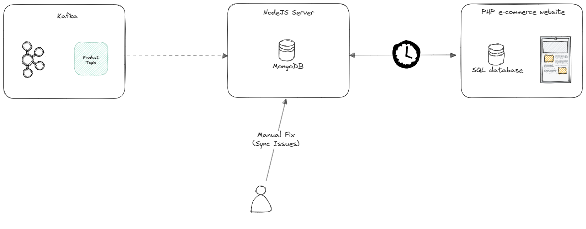
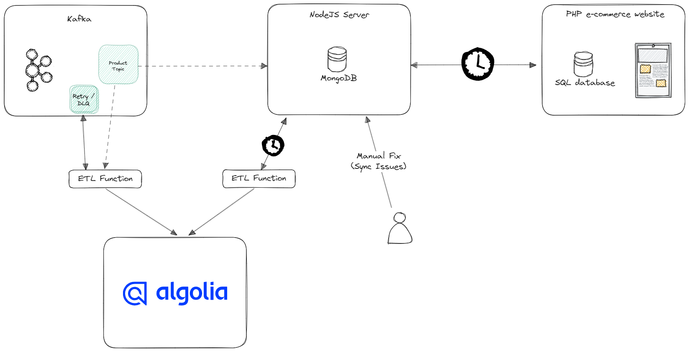
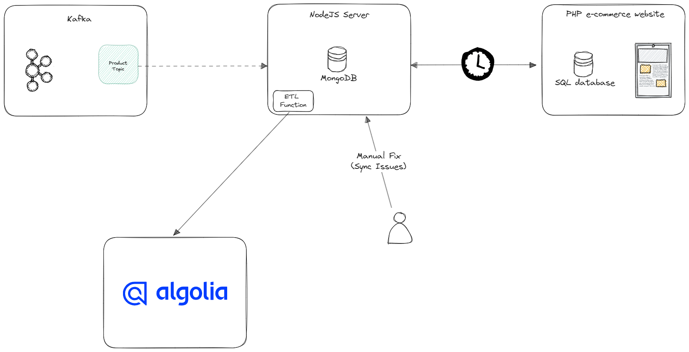

# Systems integration

Your mission is to design and implement a complex data integration solution that connects
the following systems with Algolia.

1. **A bespoke e-commerce website with a PHP backend and a SQL database:**  
This website can only expose article IDs via an internal API endpoint that can only be
accessed within the client's network.  
Furthermore, this API can only return up to 1000 results per request and cannot be
called more than 10 times a second for performance concerns.

2. **A bespoke system with a Node JS backend and a MongoDB database:**  
This system outputs an XML product catalog at a given secure URL.
This catalog contains all articles available on the website and is pulled by the website
every hour to update the information displayed. The only way for the website to get
article information is by pulling the catalog and connecting each article via ID.

3. **A Kafka topic:**  
This topic gets populated from a third-party tool, disconnected from the main
website.  
The messages include article parameter updates.  
The updates in the topic are critical for keeping the XML product catalog up-to-date.
However, not all parameters from the Kafka messages are pulled into the catalog.
The queue has multiple consumer groups, concurrently listening to these messages
to update other systems.

All of the above systems are **production-only** and the client has not mentioned
development/staging environments.

The client has also **reported some synchronisation issues** at times between the Kafka
messages and the catalog.

As such, **the catalog has to be considered the main source of truth** in these events.

**The main goal is to produce a unified and accurate product catalog to be indexed by
Algolia.**

---

## Current State

## Ideal State

1. **Event-Driven Design:**  Given the existence of Kafka already in place, we would ideally tie into those events to provide real-time updates. This would allow for near real-time syncing and data accuracy.
2. **Data Fromatting:** Since not all fields are from Kafka are synced and the data payload between Kafka and algolia do not match, an intermediary function must be deployed. This function can subscribe the topic, make any necessary transformations, and finally post the data to algolia's API.
3. **Limits:** Since the PHP website has performance limitations, it's recommended to avoid making any API calls to the website. In addition, it's important for the event-driven sync to properly handle retries and failures. This can be achieved through new retry and dead-letter-queue topics as well as implementing an exponential backoff with a randomized jitter.
4. **Fallback:** While the new error handling should catch and identify the syncing issues, a fallback should be implemented leveraging the XML product catalog from the NodeJS Server. This fall back can be triggered on a schedule to ensure the data within algolia matches the main source of truth.

## Proposed State

While I prefer an event-driven solution, the PHP e-commerce website is currently being updated hourly. I'm not certain how the website will respond to products being available in search that are not yet synced to the e-commerce solution. Without extensive testing, it would be a safer and simpler solution to sync the search catalog *after* the products are synced to the e-commerce website.

While an hourly chron job can be established, a simpler approach would be for the e-commerce website sync to trigger the push to algolia. A new process within the NodeJS system can be introduced to push the product catalog to the algolia indices.

